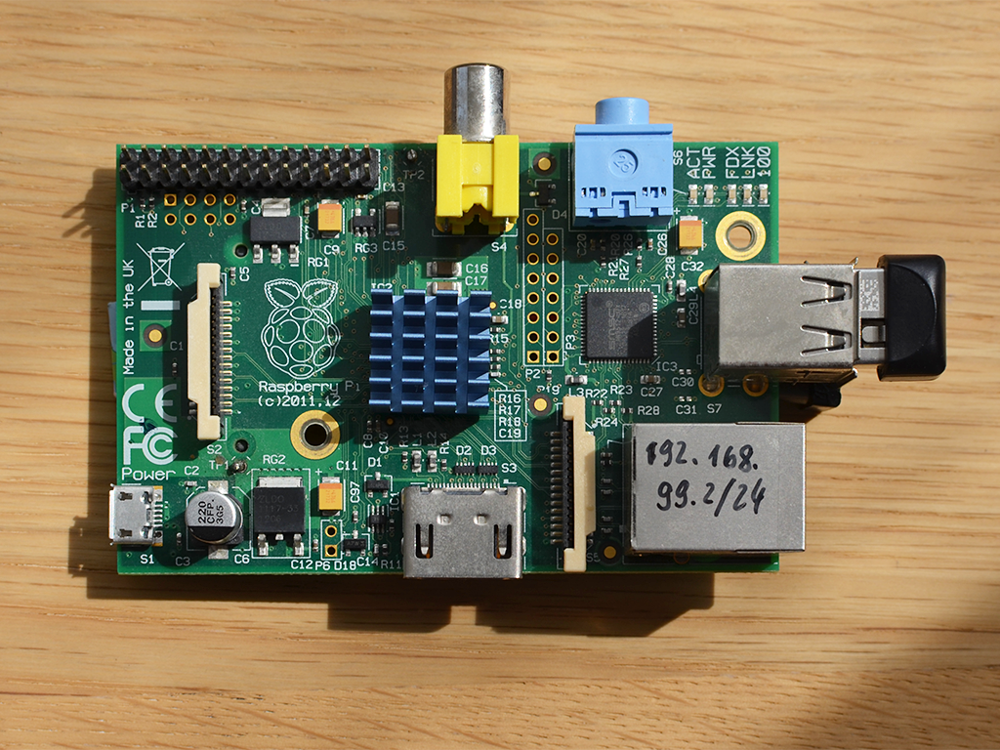
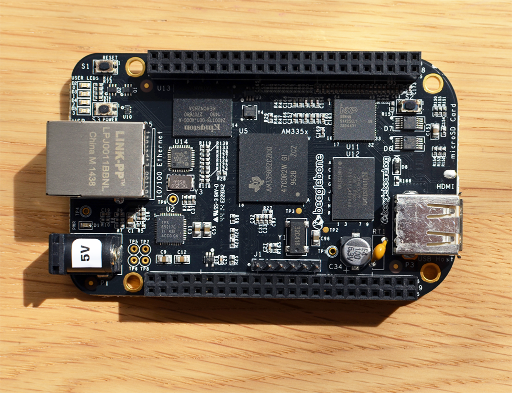
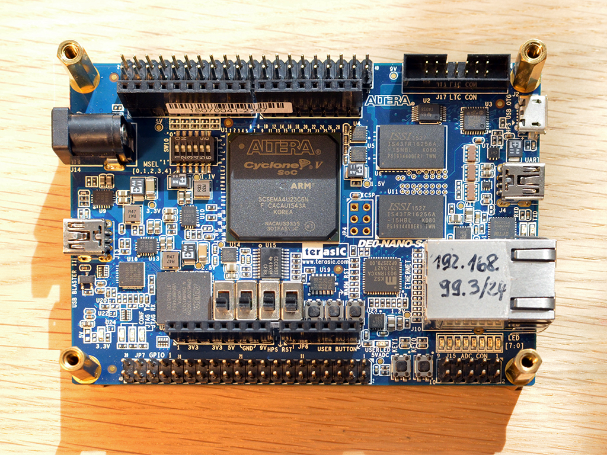
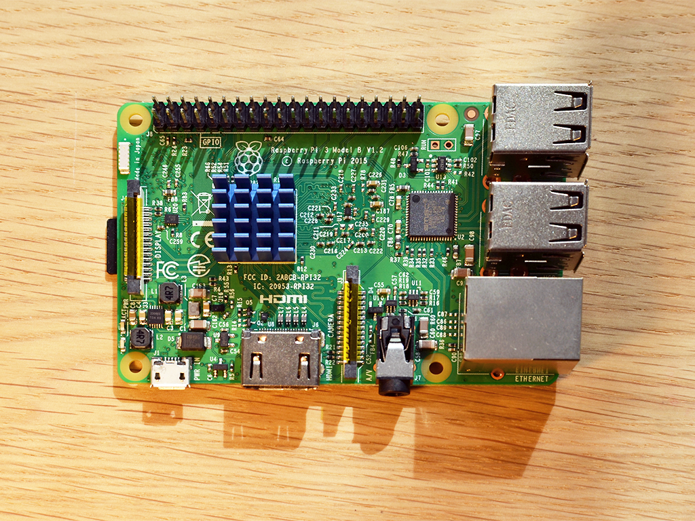

# sbc-benchmarks

A set of standard benchmarks exist that can help evaluate single board system performance and their suitability for certain tasks. The sbc-benchmarks package was created to run a basic set of benchmarks while tracking compile options, scripts and results to ensure repeatability and consistent execution across different boards.

The following standard bencharks are currently set up and run by sbc-benchmarks:

- Coremark  (CPU Performance)
- Whetstone (Floating Point Performance)
- Dhrystone (Integer Performance)
- Stream    (Memory Performance)
- dd        (Disk I/O Performance)
- CPUminer  (Bitcoin/Litecoin mining Performance)

The following single-board systems have been tested with sbc-benchmarks:

| Board                  | Vendor                    | Image |
|------------------------|---------------------------|-------|
| Raspberry Pi 1B        | <a href="https://www.raspberrypi.org/">Raspberry Pi Foundation</a> |  |
| Raspberry Pi 0W        | <a href="https://www.raspberrypi.org/">Raspberry Pi Foundation</a> | |
| BeagleBone Black Rev C | <a href="https://beagleboard.org/">BeagleBoard.org Foundation</a>  |   |
| Raspberry Pi 2B        | <a href="https://www.raspberrypi.org/">Raspberry Pi Foundation</a> | |
| DE0-Nano-SoC (Atlas)   | <a href="https://www.altera.com/">Intel PSG (Altera)</a>           |  |
| Raspberry Pi 3         | <a href="https://www.raspberrypi.org/">Raspberry Pi Foundation</a> |  |

## Hardware and Compiler optimization

To achieve the best possible results, benchmarks need to be compiled with optimization for the specific hardware and CPU.

[Hardware Information](hw-information.md)

All boards above are equipped with ARM-based CPU. ARM currently dominates the market for mobile computing, and has a strong presence in the embbeded CPU market. Hence, the compiler optimization data below is for ARM.

[GCC Compiler Optimization](gcc-optimization.md)

## SBC Benchmark Results

|System          |Core Mark|C-Mark Mhz|Whetstone|Dhrystone|DMIPS|Stream Copy|Stream Scale|Disk Read|Disk Write|
|----------------|--------:|---------:|--------:|--------:|----:|----------:|-----------:|--------:|---------:|
|Raspberry Pi 1B |    1357|1.94|82.6|1388889|1.13|770.6|212.3|21.9|10.2|
|Raspberry Pi 0W |    2084|2.08|118.2|2083333|1.19|842.5|274.4|22.4|7.1|
|Beaglebone Black|    2497|2.49|485.4|3030303|1.72|562.7|429.3|34.8|13.1|
|Raspberry Pi 2B |    3097|3.09|487.5|2173913|1.37|1359.5|1411.6|22.4|22.0|
|Altera Atlas SoC|    6596|7.13|1923.1|3703704|2.28|935.5|1279.6|21.6|21.3|
|Raspberry Pi 3  |    7108|5.92|2000.0|4347826|2.06|2184.9|2177.3|22.8|10.5|

### Details

- [Coremark](cm-benchmark.md)
- [Whetstone](ws-benchmark.md)
- [Dhrystone](ds-benchmark.md)
- [Stream](st-benchmark.md)
- [Disk IO](io-benchmark.md)
- [CPUminer](bc-benchmark.md)
